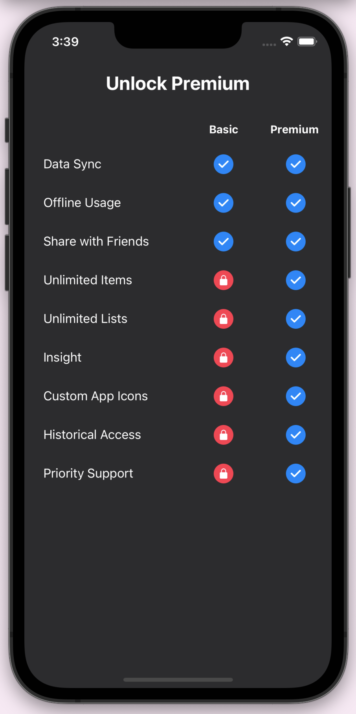

[](https://github.com/WrathChaos/react-native-premium-table)

[](https://github.com/WrathChaos/react-native-premium-table)

[](https://www.npmjs.com/package/react-native-premium-table)
[](https://www.npmjs.com/package/react-native-premium-table)

[](https://opensource.org/licenses/MIT)
[](https://github.com/prettier/prettier)

<p align="center">
  
</p>

# Installation

Add the dependency:

```bash
npm i react-native-premium-table
```

## Peer Dependencies

<h5><i>IMPORTANT! You need install them</i></h5>

```js
"react-native-easy-grid": ">= 0.2.2"
```

# Usage

## Import

```jsx
import PremiumTable, { Item } from "react-native-premium-table";
```

## Fundamental Usage

```jsx
<PremiumTable data={mockData} />
```

## Data Format

```js
const mockData = [
  {
    name: "Data Sync",
    isBasic: true,
    isPremium: true,
  },
  {
    name: "Offline Usage",
    isBasic: true,
    isPremium: true,
  },
  {
    name: "Share with Friends",
    isBasic: true,
    isPremium: true,
  },
  {
    name: "Unlimited Items",
    isBasic: false,
    isPremium: true,
  },
  {
    name: "Unlimited Lists",
    isBasic: false,
    isPremium: true,
  },
  {
    name: "Insight",
    isBasic: false,
    isPremium: true,
  },
  {
    name: "Custom App Icons",
    isBasic: false,
    isPremium: true,
  },
  {
    name: "Historical Access",
    isBasic: false,
    isPremium: true,
  },
  {
    name: "Priority Support",
    isBasic: false,
    isPremium: true,
  },
];
```

## Example Project 😍

You can checkout the example project 🥰

Simply run

- `npm i`
- `react-native run-ios/android`

should work of the example project.

# Configuration - Props

## Fundamentals

| Property |  Type  |  Default  | Description            |
| -------- | :----: | :-------: | ---------------------- |
| data     | Item[] | undefined | set the formatted data |

## Customization (Optionals)

| Property         |        Type         |  Default  | Description                                               |
| ---------------- | :-----------------: | :-------: | --------------------------------------------------------- |
| style            |      ViewStyle      |  default  | set or override the style object for the `main container` |
| headerStyle      |      ViewStyle      |  default  | set or override the style object for the `header`         |
| basicText        |       string        |  "Basic"  | change the basic column's text                            |
| premiumText      |       string        | "Premium" | change the premium column's text                          |
| checkCircleStyle |      ViewStyle      |  default  | set or override the style object for the `check` circle   |
| iconImageStyle   |     ImageStyle      |  default  | set or override the style object for the `icon` image     |
| checkImageSource | ImageSourcePropType |  default  | set your own `check` image                                |
| lockImageSource  | ImageSourcePropType |  default  | set your own `lock` image                                 |

## Future Plans

- [x] ~~LICENSE~~
- [ ] Write an article about the lib on Medium

## Author

FreakyCoder, kurayogun@gmail.com

## License

React Native Premium Table is available under the MIT license. See the LICENSE file for more info.
